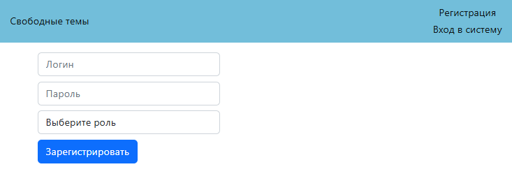
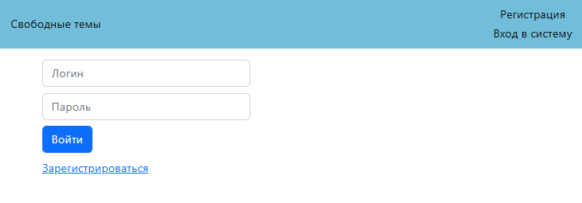
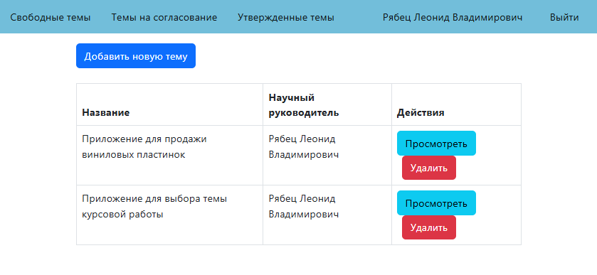
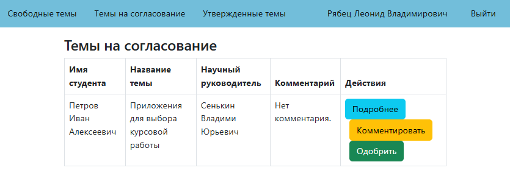
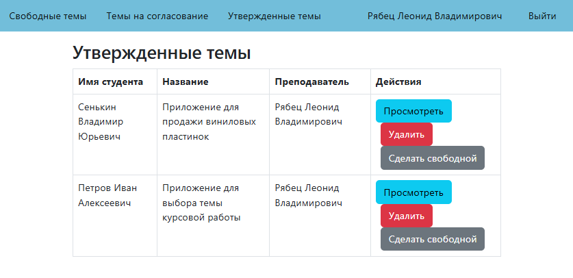
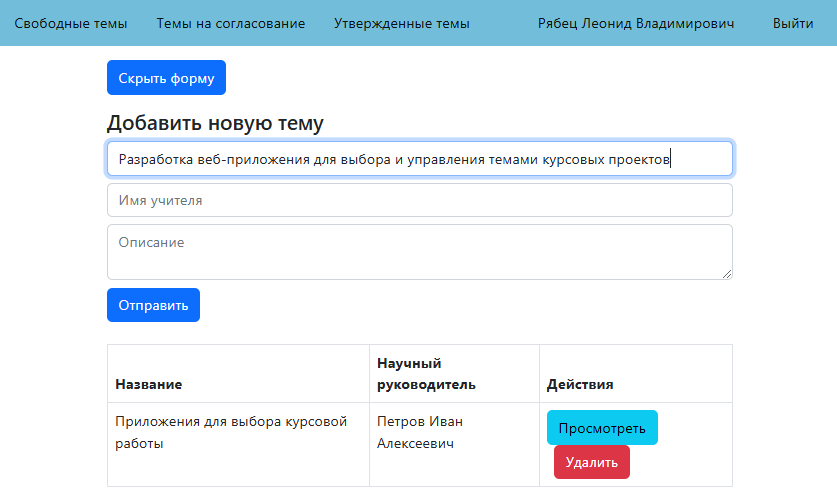
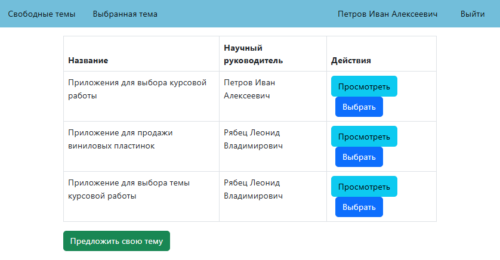
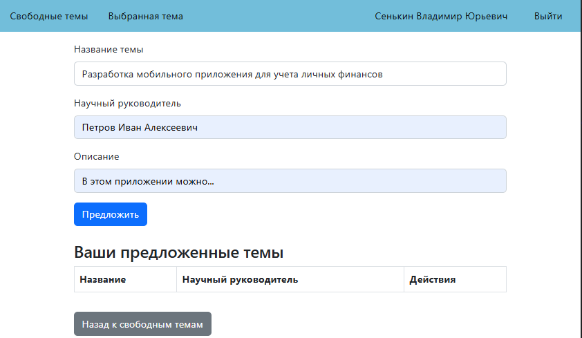
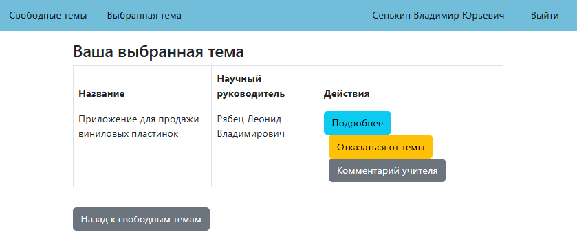

# 🎓 Курсовая работа: Веб-приложение для выбора темы курсовой работы

Это веб-приложение разработано на **Java Spring** и предназначено для управления темами курсовых работ.  
Пользователи системы делятся на **студентов** и **администраторов/преподавателей** с различными уровнями доступа.

---

## 📝 Основные функции

- Регистрация и авторизация пользователей
- Просмотр списка свободных тем
- Предложение новой темы студентом
- Управление темами администраторами (добавление/удаление)
- Согласование тем преподавателем
- Просмотр утверждённых тем

---

## 🖼️ Скриншоты

### 1. Страница регистрации

### 2. Страница авторизации

### 3. Список свободных тем для студентов

### 4. Список тем на согласование (для преподавателей)

### 5. Утверждённые темы (для администраторов)

### 6. Форма добавления новой темы (для преподавателей)

### 7. Просмотр свободных тем и выбор темы (для студентов)

### 8. Страница предложения своей темы

### 9. Страница выбранной темы студента

